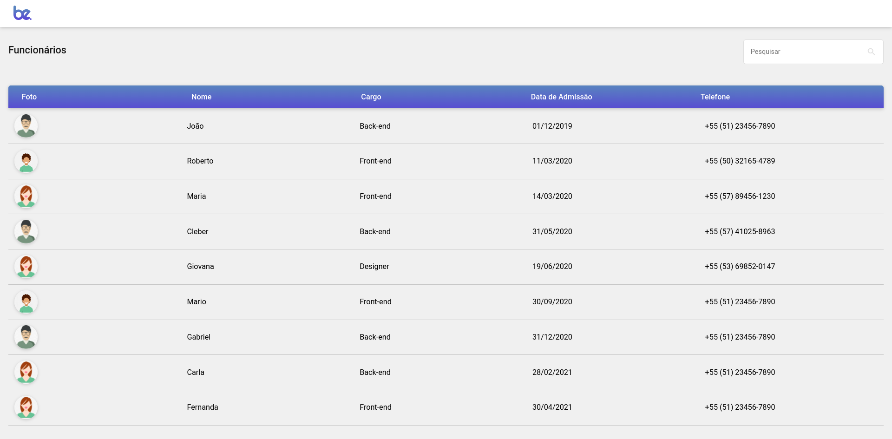
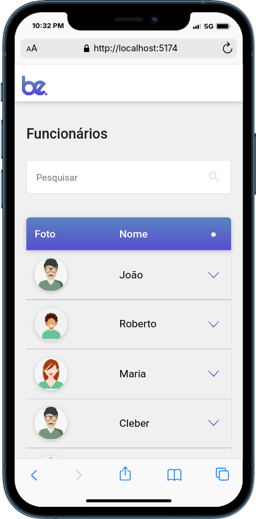

# Desafio Técnico Front-end BeTalent

## Descrição

O objetivo desse desafio era construir uma aplicação responsiva que exibe dados de funcionários em uma tabela. Os dados serão consumidos através de uma API simulada utilizando json-server. A aplicação permite a filtragem dos funcionários por cargo, nome e telefone.

## Mockup

A aplicação foi desenvolvida utilizando como base o mockup fornecido pela [BeTalent](https://betalent.tech/). Você pode acessá-lo [aqui](https://www.figma.com/file/yw6th52zE9bubewc6ayTg5/Teste-T%C3%A9cnico-Front-End-Be.?type=design&node-id=1%3A4&mode=dev&t=vVxs9eyKybrYmq4Z-1).


## Pré-requisitos
- Git
- Node.js
- Yarn

## Executando a aplicação

Para executar o projeto localmente, siga os passos abaixo:

```bash
# Clone este repositório:
git clone git@github.com:markoclimakodev/beTalent-desafio-front-end.git
cd beTalent-desafio-front-end-main

# Instale o json-server globalmente (caso ainda não tenha instalado):
yarn global add json-server

# Instale as dependências do projeto com Yarn:
yarn install

# Inicie o json-server para simular a API:
json-server --watch db.json

# Após iniciar o json-server, execute o projeto:
yarn run dev
```

## Tecnologias Utilizadas


## Screenshots

### Desktop



### Mobile



## Autor

Marcos Junior Climaco

## Contato
[](https://www.linkedin.com/in/markoclimako/)
[](mailto:mkclimako@gmail.com)
